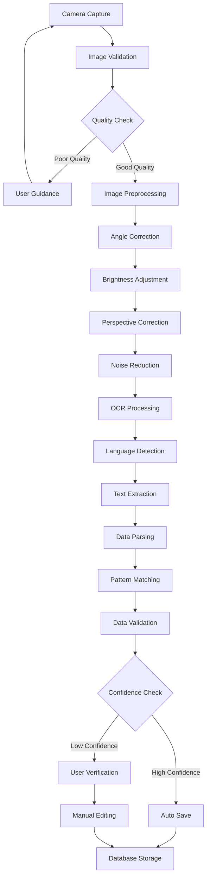

# Receipt Scanner - 技術アーキテクチャ設計

**作成日**: 2025年1月1日  
**バージョン**: 1.0.0  

---

## 1. システム全体アーキテクチャ

```
┌─────────────────────────────────────────────────────────────┐
│                    Receipt Scanner App                       │
├─────────────────────────────────────────────────────────────┤
│  Presentation Layer (UI)                                    │
│  ├─ Camera Screen                                           │
│  ├─ Preview Screen                                          │
│  ├─ Edit Screen                                             │
│  └─ History Screen                                          │
├─────────────────────────────────────────────────────────────┤
│  Business Logic Layer                                       │
│  ├─ Receipt Processing Service                              │
│  ├─ Image Preprocessing Service                             │
│  ├─ OCR Service                                             │
│  └─ Data Extraction Service                                 │
├─────────────────────────────────────────────────────────────┤
│  Data Layer                                                 │
│  ├─ Local Database (SQLite)                                │
│  ├─ File Storage                                            │
│  └─ Settings Repository                                     │
├─────────────────────────────────────────────────────────────┤
│  Platform Layer                                             │
│  ├─ Camera Hardware                                         │
│  ├─ File System                                             │
│  └─ Device Sensors                                          │
└─────────────────────────────────────────────────────────────┘
```

---

## 2. プロジェクト構造

```
receipt_scanner/
├── lib/
│   ├── main.dart
│   ├── app/
│   │   ├── app.dart
│   │   └── routes/
│   │       └── app_routes.dart
│   ├── core/
│   │   ├── config/
│   │   │   └── app_config.dart
│   │   ├── constants/
│   │   │   ├── app_constants.dart
│   │   │   └── regex_patterns.dart
│   │   ├── errors/
│   │   │   └── exceptions.dart
│   │   ├── utils/
│   │   │   ├── logger.dart
│   │   │   └── validators.dart
│   │   └── extensions/
│   │       ├── string_extensions.dart
│   │       └── datetime_extensions.dart
│   ├── data/
│   │   ├── models/
│   │   │   ├── receipt.dart
│   │   │   ├── receipt_item.dart
│   │   │   └── processing_result.dart
│   │   ├── repositories/
│   │   │   ├── receipt_repository.dart
│   │   │   └── settings_repository.dart
│   │   └── datasources/
│   │       ├── local/
│   │       │   ├── database/
│   │       │   │   ├── database.dart
│   │       │   │   └── receipt_dao.dart
│   │       │   └── file_storage/
│   │       │       └── image_storage.dart
│   ├── services/
│   │   ├── camera/
│   │   │   └── camera_service.dart
│   │   ├── image_processing/
│   │   │   ├── image_preprocessor.dart
│   │   │   ├── angle_corrector.dart
│   │   │   ├── brightness_adjuster.dart
│   │   │   └── perspective_corrector.dart
│   │   ├── ocr/
│   │   │   ├── ml_kit_service.dart
│   │   │   └── text_analyzer.dart
│   │   ├── extraction/
│   │   │   ├── receipt_parser.dart
│   │   │   ├── pattern_matchers/
│   │   │   │   ├── amount_matcher.dart
│   │   │   │   ├── date_matcher.dart
│   │   │   │   ├── merchant_matcher.dart
│   │   │   │   └── language_specific/
│   │   │   │       ├── finnish_patterns.dart
│   │   │   │       ├── swedish_patterns.dart
│   │   │   │       ├── french_patterns.dart
│   │   │   │       ├── german_patterns.dart
│   │   │   │       ├── italian_patterns.dart
│   │   │   │       └── spanish_patterns.dart
│   │   │   └── data_validator.dart
│   │   └── export/
│   │       ├── csv_exporter.dart
│   │       └── json_exporter.dart
│   ├── presentation/
│   │   ├── providers/
│   │   │   ├── camera_provider.dart
│   │   │   ├── receipt_provider.dart
│   │   │   └── processing_provider.dart
│   │   ├── screens/
│   │   │   ├── camera/
│   │   │   │   ├── camera_screen.dart
│   │   │   │   └── widgets/
│   │   │   │       ├── camera_preview.dart
│   │   │   │       ├── capture_button.dart
│   │   │   │       └── flash_toggle.dart
│   │   │   ├── preview/
│   │   │   │   ├── preview_screen.dart
│   │   │   │   └── widgets/
│   │   │   │       ├── image_preview.dart
│   │   │   │       ├── processing_indicator.dart
│   │   │   │       └── quick_actions.dart
│   │   │   ├── edit/
│   │   │   │   ├── edit_screen.dart
│   │   │   │   └── widgets/
│   │   │   │       ├── data_editor.dart
│   │   │   │       ├── field_editor.dart
│   │   │   │       └── confidence_indicator.dart
│   │   │   ├── history/
│   │   │   │   ├── history_screen.dart
│   │   │   │   └── widgets/
│   │   │   │       ├── receipt_list.dart
│   │   │   │       ├── receipt_card.dart
│   │   │   │       └── search_bar.dart
│   │   │   └── settings/
│   │   │       ├── settings_screen.dart
│   │   │       └── widgets/
│   │   │           ├── language_selector.dart
│   │   │           └── processing_options.dart
│   │   └── widgets/
│   │       ├── common/
│   │       │   ├── loading_indicator.dart
│   │       │   ├── error_dialog.dart
│   │       │   └── confirmation_dialog.dart
│   │       └── receipt/
│   │           ├── receipt_summary.dart
│   │           └── receipt_details.dart
│   └── l10n/
│       ├── app_localizations.dart
│       ├── app_en.arb
│       ├── app_fi.arb
│       ├── app_sv.arb
│       ├── app_fr.arb
│       ├── app_de.arb
│       ├── app_it.arb
│       └── app_es.arb
├── test/
│   ├── unit/
│   │   ├── services/
│   │   ├── models/
│   │   └── utils/
│   ├── widget/
│   │   └── screens/
│   └── integration/
│       └── app_test.dart
├── assets/
│   ├── images/
│   │   ├── sample_receipts/
│   │   └── icons/
│   └── test_data/
│       └── sample_receipts/
│           ├── finnish/
│           ├── swedish/
│           ├── french/
│           ├── german/
│           ├── italian/
│           └── spanish/
├── android/
├── ios/
├── docs/
│   ├── development-requirements.md
│   ├── technical-architecture.md
│   └── api-documentation.md
├── pubspec.yaml
└── README.md
```

---

## 3. データフロー

### 3.1 レシート処理フロー



---

## 4. 状態管理アーキテクチャ

### 4.1 Riverpod Provider構造

```dart
// プロバイダー階層
┌── App State Providers
│   ├── themeProvider
│   ├── localeProvider
│   └── settingsProvider
│
├── Camera State Providers  
│   ├── cameraControllerProvider
│   ├── cameraPermissionProvider
│   └── flashModeProvider
│
├── Processing State Providers
│   ├── imageProcessingProvider
│   ├── ocrProcessingProvider
│   └── extractionProcessingProvider
│
├── Data State Providers
│   ├── receiptListProvider
│   ├── currentReceiptProvider
│   └── editModeProvider
│
└── UI State Providers
    ├── navigationProvider
    ├── loadingProvider
    └── errorProvider
```

---

## 5. データベース設計

### 5.1 SQLite テーブル構造

```sql
-- receipts テーブル
CREATE TABLE receipts (
    id TEXT PRIMARY KEY,
    original_image_path TEXT NOT NULL,
    processed_image_path TEXT,
    raw_ocr_text TEXT,
    
    -- 抽出データ
    merchant_name TEXT,
    purchase_date INTEGER,  -- Unix timestamp
    total_amount REAL,
    subtotal_amount REAL,
    tax_amount REAL,
    payment_method TEXT,
    currency TEXT,
    
    -- メタデータ
    confidence_score REAL,
    detected_language TEXT,
    created_at INTEGER,
    modified_at INTEGER,
    is_verified INTEGER DEFAULT 0,
    
    FOREIGN KEY (id) REFERENCES receipt_items(receipt_id)
);

-- receipt_items テーブル (オプション明細)
CREATE TABLE receipt_items (
    id TEXT PRIMARY KEY,
    receipt_id TEXT NOT NULL,
    name TEXT NOT NULL,
    quantity INTEGER,
    unit_price REAL,
    total_price REAL NOT NULL,
    
    FOREIGN KEY (receipt_id) REFERENCES receipts(id) ON DELETE CASCADE
);

-- settings テーブル
CREATE TABLE settings (
    key TEXT PRIMARY KEY,
    value TEXT NOT NULL
);

-- processing_history テーブル
CREATE TABLE processing_history (
    id TEXT PRIMARY KEY,
    receipt_id TEXT NOT NULL,
    processing_step TEXT NOT NULL,
    duration_ms INTEGER,
    success INTEGER,
    error_message TEXT,
    created_at INTEGER,
    
    FOREIGN KEY (receipt_id) REFERENCES receipts(id) ON DELETE CASCADE
);
```

---

## 6. 画像処理パイプライン詳細

### 6.1 OpenCV処理チェーン

```dart
class ImagePreprocessor {
  Future<ProcessedImage> processImage(String imagePath) async {
    var image = await loadImage(imagePath);
    
    // 1. 前処理
    image = await resizeIfNeeded(image);
    image = await convertToGrayscale(image);
    
    // 2. 角度補正
    final angle = await detectSkewAngle(image);
    if (angle.abs() > 1.0) {
      image = await rotateImage(image, angle);
    }
    
    // 3. パースペクティブ補正
    final corners = await detectDocumentCorners(image);
    if (corners != null) {
      image = await correctPerspective(image, corners);
    }
    
    // 4. 明度・コントラスト調整
    image = await enhanceBrightness(image);
    image = await applyCLAHE(image);
    
    // 5. ノイズ除去・シャープ
    image = await denoiseImage(image);
    image = await sharpenImage(image);
    
    return ProcessedImage(
      image: image,
      confidence: calculateQualityScore(image),
      appliedTransformations: getTransformationLog(),
    );
  }
}
```

---

## 7. OCR・データ抽出アーキテクチャ

### 7.1 言語固有パターンマッチング

```dart
abstract class LanguagePatterns {
  List<RegExp> get totalPatterns;
  List<RegExp> get taxPatterns;
  List<RegExp> get datePatterns;
  List<RegExp> get merchantPatterns;
  List<String> get currencySymbols;
  
  double parseAmount(String text);
  DateTime? parseDate(String text);
  String? detectPaymentMethod(String text);
}

// 実装例: フィンランド語
class FinnishPatterns extends LanguagePatterns {
  @override
  List<RegExp> get totalPatterns => [
    RegExp(r'(?i)(yhteensä|summa|total)[:\s]*([€]?[\s]*([\d,]+\.?\d*))', 
    RegExp(r'(?i)(loppusumma)[:\s]*([€]?[\s]*([\d,]+\.?\d*))',
    // ... その他のパターン
  ];
  
  @override
  List<RegExp> get taxPatterns => [
    RegExp(r'(?i)(alv|arvonlisävero)[:\s]*([€]?[\s]*([\d,]+\.?\d*))',
    RegExp(r'(?i)(\d+%.*alv)[:\s]*([€]?[\s]*([\d,]+\.?\d*))',
    // ... 
  ];
}
```

---

## 8. エラーハンドリング・ログ戦略

### 8.1 エラー分類

```dart
abstract class ReceiptScannerException implements Exception {
  final String message;
  final String code;
  final DateTime timestamp;
  
  const ReceiptScannerException(this.message, this.code) 
      : timestamp = DateTime.now();
}

// 具体的なエラー型
class ImageProcessingException extends ReceiptScannerException {
  final ProcessingStep step;
  ImageProcessingException(String message, this.step) 
      : super(message, 'IMG_PROCESSING');
}

class OCRException extends ReceiptScannerException {
  final double confidence;
  OCRException(String message, this.confidence) 
      : super(message, 'OCR_FAILED');
}

class DataExtractionException extends ReceiptScannerException {
  final List<String> missingFields;
  DataExtractionException(String message, this.missingFields) 
      : super(message, 'DATA_EXTRACTION');
}
```

### 8.2 ログレベル戦略

```dart
enum LogLevel { debug, info, warning, error, fatal }

class AppLogger {
  static void logImageProcessing(String step, Duration duration, bool success);
  static void logOCRResult(String language, double confidence, int textLength);
  static void logDataExtraction(Map<String, dynamic> extractedFields);
  static void logError(Exception error, StackTrace stackTrace);
  static void logPerformance(String operation, Duration duration);
}
```

---

## 9. テスト戦略

### 9.1 テストピラミッド

```
    ┌─────────────────┐
    │  E2E Tests      │  ← 統合テスト (5%)
    │  (Integration)  │
    ├─────────────────┤
    │  Widget Tests   │  ← UIテスト (25%)
    │                 │
    ├─────────────────┤
    │  Unit Tests     │  ← ロジックテスト (70%)
    │                 │
    └─────────────────┘
```

### 9.2 テスト対象

#### Unit Tests
- 画像処理アルゴリズム
- パターンマッチング
- データ変換ロジック
- バリデーション

#### Widget Tests
- カメラ画面
- 編集画面
- 履歴画面
- 設定画面

#### Integration Tests
- カメラ → 処理 → 保存フロー
- インポート → 編集 → エクスポートフロー
- エラーハンドリングフロー

---

## 10. パフォーマンス最適化

### 10.1 処理最適化戦略

```dart
class PerformanceOptimizer {
  // 段階的処理：低解像度で検証→高解像度で処理
  static const PREVIEW_MAX_WIDTH = 800;
  static const PROCESSING_MAX_WIDTH = 2000;
  
  // 並列処理：複数アルゴリズムの同時実行
  Future<List<ProcessingResult>> parallelProcess(Image image) async {
    return await Future.wait([
      processAngleCorrection(image),
      processBrightnessAnalysis(image),
      processPerspectiveDetection(image),
    ]);
  }
  
  // キャッシュ戦略
  static final Map<String, ProcessedImage> _processedCache = {};
  static final Map<String, ExtractedData> _extractedCache = {};
}
```

---

このアーキテクチャに基づいて、次にFlutterプロジェクトの初期セットアップを行いましょう。