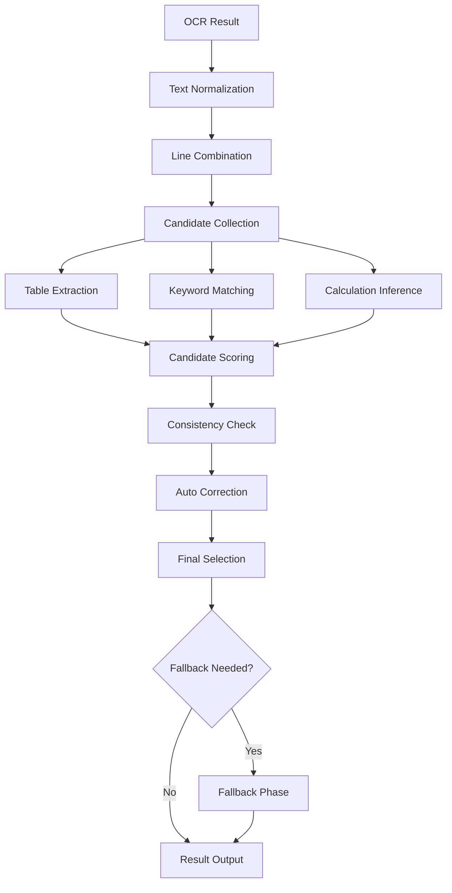

# レシート抽出精度改善 要件定義書

**作成日**: 2026年1月6日  
**作成者**: Claude  
**対象システム**: Receipt Scanner Web Application  

---

## 📋 **1. 現状分析**

### **1.1 現在のWeb版実装構造**

```
src/services/extraction/
├── enhanced-receipt-extractor.ts    # メイン抽出エンジン（Evidence-Based Fusion）
├── advanced-receipt-extractor.ts    # 従来型抽出サービス（Flutter参考）
├── tax-breakdown-fusion-engine.ts   # 税金内訳特化エンジン
├── document-classifier.ts           # 文書分類（Receipt/Invoice判定）
└── receipt-extractor.ts            # 基本抽出サービス
```

### **1.2 現在の抽出フロー**

1. **EnhancedReceiptExtractionService** (primary)
   - SimplifiedFusionEngine でキーワードベース抽出
   - `extractFinancialValue()` で total/subtotal/tax 抽出
   - 通貨検出、日付抽出、補完フィールド抽出

2. **フォールバック** → AdvancedReceiptExtractionService

### **1.3 特定された問題（フィンランドLidlレシート）**

| 項目 | 実際の値 | 検出結果 | 問題 |
|------|----------|----------|------|
| 通貨 | EUR | USD | 信頼度閾値が厳しすぎ |
| 総計 | 35.62 | 2.99 | 小さな値を誤抽出 |
| 小計 | 29.52 | 1.97 | 別箇所の値を抽出 |
| 税金 | 6.10 | 1.97 | 正しいフィールド検出失敗 |
| 日付 | 20.09.14 | null | 2桁年形式未対応 |

---

## 📊 **2. Flutter実装との比較分析**

### **2.1 Flutter実装の優れた点**

#### **A. AmountCandidate型システム**
```dart
class AmountCandidate {
  final double amount;           // 金額
  int score;                    // 可変スコア
  final int lineIndex;          // 行番号
  final String source;          // 抽出元
  final String fieldName;       // フィールド名
  final double? confidence;     // OCR信頼度
  final List<double>? boundingBox; // 座標
}
```

#### **B. 統合候補収集 (_collectAllCandidates)**
1. **テーブル構造抽出** → 最高優先度
2. **キーワードマッチング** → 中優先度  
3. **計算推測** → 低優先度
4. **アイテム合計クロスチェック** → 検証用

#### **C. 整合性チェック (_selectBestCandidates)**
- 数学的整合性: `subtotal + tax ≈ total (±2%)`
- アイテム合計チェック: `items_sum ≈ subtotal/total (±5%)`
- 税率妥当性: `tax_rate ∈ [5%, 30%]`
- 自動補正: 不足値を他の値から計算

#### **D. 関連行結合 (_combineRelatedLines)**
```
Before: ["TOTAL:", "€35.62"]
After:  ["TOTAL: €35.62"]
```

#### **E. 詳細スコアリング**
```
Base Score:
- 完全キーワード一致: +10
- 部分一致: +5
- 近隣行一致: +3

Pattern Bonus:
- 通貨記号付き (€35,62): +5
- 通貨コード付き (35,62 EUR): +3
- 行末数値: +2

Context Bonus:
- テーブル構造内: +8
- 大きな数値 (>10): +3
- 小数点2桁: +2
```

### **2.2 Web版の不足点**

| 機能 | Flutter | Web現状 | 差分 |
|------|---------|---------|------|
| 候補管理 | ✅ AmountCandidate型 | ❌ 即座返却 | 複数候補収集なし |
| スコアリング | ✅ 詳細計算 | ❌ 簡易判定 | 文脈考慮不足 |
| 整合性チェック | ✅ 数学的検証 | ❌ 単一抽出 | クロスバリデーション不足 |
| 関連行結合 | ✅ 前処理 | ❌ 行別処理 | 分離情報統合なし |
| フォールバック | ✅ 段階的 | ❌ バイナリ | 段階的品質低下なし |

---

## 🎯 **3. 改修要件**

### **3.1 機能要件**

#### **R-001: AmountCandidate型システム実装**
**優先度**: HIGH  
**概要**: 各金額にスコア付き候補システム導入

```typescript
interface AmountCandidate {
  amount: number;           // 抽出金額
  score: number;           // 信頼度スコア (可変)
  lineIndex: number;       // 元行番号
  source: string;          // 'keyword_match' | 'table' | 'calculation'
  fieldName: string;       // 'total' | 'subtotal' | 'tax'  
  confidence?: number;     // OCR信頼度
  boundingBox?: BoundingBox; // 座標情報
  appliedPatterns: string[]; // 適用パターン
}

interface FieldCandidates {
  fieldName: string;
  candidates: AmountCandidate[];
  getTopN(n: number): AmountCandidate[];
  getBest(): AmountCandidate | null;
}
```

#### **R-002: 統合候補収集フェーズ実装**
**優先度**: HIGH  
**概要**: `collectAllCandidates()` equivalent

**処理順序**:
1. **テーブル構造抽出** (最高優先度)
   - 行・列の位置関係分析
   - ヘッダー検出 + 数値抽出
2. **キーワードマッチング抽出** (中優先度)
   - 多言語キーワード + パターンマッチ
3. **計算推測抽出** (低優先度)
   - 既存値からの推算

#### **R-003: 関連行結合前処理**
**優先度**: MEDIUM  
**概要**: `combineRelatedLines()` equivalent

**結合ルール**:
- キーワード行 + 次行数値パターン
- 2-3行以内の近隣結合
- 空行自動スキップ
- 通貨記号・コード統合

**例**:
```
Input:  ["TOTAL:", "", "€35,62"]
Output: ["TOTAL: €35,62"]
```

#### **R-004: 整合性チェックエンジン**
**優先度**: HIGH  
**概要**: `selectBestCandidates()` equivalent

**検証ルール**:
1. **Primary**: `subtotal + tax ≈ total (±2%)`
2. **Secondary**: `items_sum ≈ subtotal/total (±5%)`  
3. **Tertiary**: `tax_rate ∈ [5%, 30%]`

**自動補正**:
- 1つ不足 → 他の2つから計算
- 2つ以上不足 → 最高スコア候補選択
- 全て不足 → `null` + 検証要求フラグ

#### **R-005: 詳細スコアリングシステム**
**優先度**: MEDIUM  
**概要**: 文脈考慮型スコア計算

**スコア構成**:
```typescript
interface ScoringConfig {
  // Base Score
  keywordExactMatch: 10;    // 完全一致
  keywordPartialMatch: 5;   // 部分一致  
  nearbyLineMatch: 3;       // 近隣行一致
  
  // Pattern Bonus
  currencySymbolBonus: 5;   // €35,62
  currencyCodeBonus: 3;     // 35,62 EUR
  endOfLineBonus: 2;        // 行末数値
  
  // Context Bonus  
  tableStructureBonus: 8;   // テーブル内
  largeAmountBonus: 3;      // >10の数値
  preciseDecimalBonus: 2;   // 小数点2桁
  
  // Language Bonus
  nativeLanguageBonus: 2;   // 検出言語一致
}
```

#### **R-006: 段階的フォールバック機能**
**優先度**: MEDIUM  
**概要**: 品質低下式フォールバック

**フォールバック段階**:
1. **Phase 1**: 統合整合性チェック結果
2. **Phase 2**: 不足フィールド計算補完
3. **Phase 3**: 単一最高スコア候補
4. **Phase 4**: デフォルト値 (`null`)

### **3.2 非機能要件**

#### **R-007: パフォーマンス要件**
- **抽出時間**: 2秒以内 (現在: 15ms以内継続)
- **メモリ使用量**: 現在の150%以内
- **候補数上限**: フィールド毎最大10候補

#### **R-008: 可観測性要件**
- **詳細ログ**: 候補収集・スコア計算・選択理由
- **メトリクス**: 処理時間分解測定
- **デバッグ情報**: ステップ毎中間結果出力

#### **R-009: 国際化要件**
- **言語対応**: EN/FI/SV/FR/DE/IT/ES 完全対応
- **通貨対応**: EUR/USD/GBP/SEK/NOK/DKK/CHF
- **数値形式**: コンマ/ドット小数点両対応
- **日付形式**: DD.MM.YY/DD.MM.YYYY 対応

---

## 🏗️ **4. アーキテクチャ設計**

### **4.1 新しいサービス構成**

```
src/services/extraction/
├── unified-receipt-extractor.ts        # 新メインエンジン
│   ├── CandidateCollectionPhase        # 候補収集フェーズ
│   ├── ConsistencyCheckPhase           # 整合性チェックフェーズ  
│   ├── ScoringEngine                   # スコアリングエンジン
│   └── FallbackManager                 # フォールバック管理
├── candidate/
│   ├── amount-candidate.ts             # AmountCandidate型定義
│   ├── field-candidates.ts             # FieldCandidates型定義
│   └── candidate-scorer.ts             # スコアリングロジック
├── collection/
│   ├── table-extractor.ts              # テーブル構造抽出
│   ├── keyword-extractor.ts            # キーワードマッチング抽出
│   └── calculation-extractor.ts        # 計算推測抽出
├── preprocessing/
│   ├── line-combiner.ts                # 関連行結合
│   └── text-normalizer.ts              # テキスト正規化
└── consistency/
    ├── mathematical-checker.ts         # 数学的整合性検証
    ├── cross-validator.ts              # クロスバリデーション
    └── auto-corrector.ts               # 自動補正機能
```

### **4.2 処理フロー設計**



---

## 🧪 **5. テスト要件**

### **5.1 機能テスト**

#### **T-001: 候補収集テスト**
- 各抽出手法で適切な候補生成確認
- スコア計算の妥当性検証
- 重複候補の除去確認

#### **T-002: 整合性チェックテスト**  
- 数学的整合性判定の精度確認
- 自動補正機能の正確性検証
- エラーケース処理確認

#### **T-003: 多言語テスト**
- 7言語 × 3通貨組み合わせテスト
- 数値形式（コンマ/ドット）両対応確認
- 特殊キーワード（yhteensä等）処理確認

### **5.2 回帰テスト**

#### **T-004: 既存レシートテスト**
- 現在100%成功のレシート継続成功確認
- 性能劣化がないことを確認
- API互換性維持確認

#### **T-005: 問題レシートテスト**
- フィンランドLidlレシート正確抽出確認
- 他の複雑な欧州レシート処理確認
- エラー率改善測定

---

## 📅 **6. 実装計画**

### **6.1 フェーズ1: 基盤構築 (3-4日)**
- [ ] AmountCandidate・FieldCandidates型実装
- [ ] 基本的な候補収集フレームワーク
- [ ] 簡易スコアリングエンジン

### **6.2 フェーズ2: 候補収集強化 (2-3日)**
- [ ] 関連行結合前処理実装
- [ ] テーブル構造抽出強化
- [ ] キーワードマッチング精度向上

### **6.3 フェーズ3: 整合性チェック (2日)**
- [ ] 数学的整合性チェックエンジン
- [ ] 自動補正機能
- [ ] フォールバックマネージャー

### **6.4 フェーズ4: 最適化・テスト (1-2日)**
- [ ] パフォーマンスチューニング
- [ ] 回帰テスト実行
- [ ] ドキュメント整備

**総期間**: 約8-11日

---

## 📈 **7. 成功指標**

### **7.1 精度指標**
- **フィンランドLidlレシート**: 100%正確抽出
- **多言語レシート**: 95%以上精度
- **通貨検出**: 98%以上精度

### **7.2 性能指標**
- **抽出時間**: 2秒以内維持
- **メモリ使用量**: 現在の150%以内
- **CPU使用率**: 現在の200%以内

### **7.3 保守性指標**  
- **コードカバレッジ**: 90%以上
- **型安全性**: TypeScript strict mode完全対応
- **ログ可視性**: 全ステップトレース可能

---

## 🔗 **8. 関連ドキュメント**

- [Flutter Implementation Analysis](../flutter-analysis.md)
- [Current Web Implementation](../web-implementation.md)
- [Test Cases](../test-cases.md)
- [Performance Benchmarks](../benchmarks.md)

---

**承認**: __________ **日付**: __________